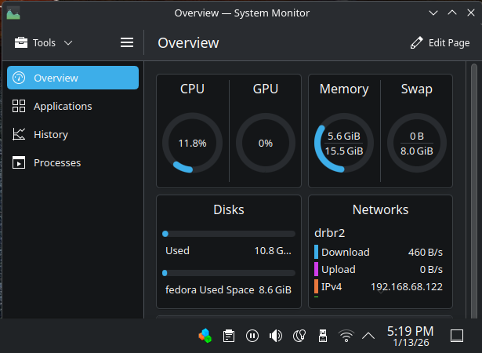
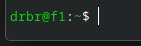
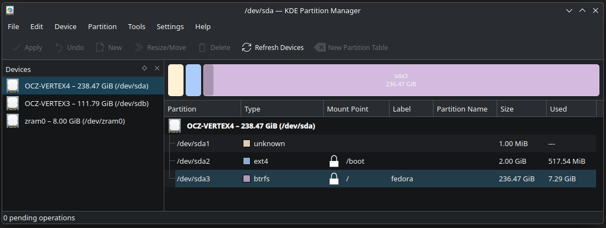
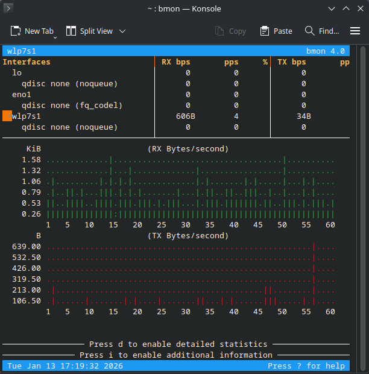

# Fedora Linux - with KDE Plasma

How to view this MarkDown (.md) file:

    Using Edge browser, I have loaded these 2 extensions and toggle between them:  
        MarkView - has a nice Table of Contents (on right) + light/dark button (bottom right)
        Markdown Viewer - no TOC, can set dark mode thru settings, has more readable comments in code sections


## Intro

This document is an introduction to Fedora Linux. It covers the essential basics across several topics, including installation, KDE, system monitors, Bash, the Konsole terminal, mounting drives, Python, taking screenshots, and recovering the OS when it fails to boot. There are also a few reference links at the bottom of the document.

## KDE

KDE originally stood for *Kool Desktop Environment* and serves as the graphical desktop layer on top of Fedora Linux.

## Context

After seeing reviews online, I decided to re-purpose my old 2011 PC by installing the Linux distribution called *Fedora KDE Plasma*. I originally built this machine in 2011 using an Intel Core i7‑2600K CPU on an ASUS P8Z68‑V Pro motherboard, with 16 GB of RAM, a 256 GB SSD, a Wi‑Fi card, and no dedicated graphics card. I connected my HD monitor directly to the motherboard’s HDMI port. The system is running BIOS version 3603 from 11/9/2012.

## Install

I downloaded the Fedora KDE Plasma ISO from [fedoraproject.org](https://fedoraproject.org/kde/) and flashed it to an 8 GB USB stick using [balenaEtcher](https://etcher.balena.io/), creating a bootable installer. I then booted the old PC from the USB drive, selected “Install,” and chose the option to overwrite all partitions, which removed the previous Windows 10 installation. I skipped a dual‑boot setup since I’ve run into issues with that approach before. The entire installation process took roughly 10–15 minutes from start to finish.

## Main Menu
(also called the Application Launcher / KDE Menu)

Firefox comes pre‑installed, along with Dolphin (file manager), Konsole, Discover, System Monitor, the Settings app, and other core KDE tools.

I installed Kate and Visual Studio Code as additional applications, seen here:


## Network Monitor

I also installed bmon, a command‑line network traffic monitor. It doesn’t appear in the menu above because it’s a terminal‑based tool. I cover it near the end of the page, after introducing the Bash environment it runs in.

## System Monitor

Showing 2 disk drives, CPU, RAM, WiFi.



<br>
<br>

# Terminal Basics in Konsole

You can accomplish plenty through KDE’s graphical icons, but Linux often requires using the Command Line Interface (CLI) through a terminal window.

    Ctrl-Alt-T  ---  Open a Terminal Window - or click Konsole icon in Main Menu, as seen above

## Command Prompt


The last line above shows the command prompt.

### Breakdown

    drbr = my username
    f1 = my hostname
    ~ = shorthand for home dir (in my case /home/drbr)
    $ = the command prompt for normal user (not root or superuser, that is #)
    █ = the cursor

In Konsole settings you can change the cursor to a vertical line (aka I-beam) so it looks as follows.



## Commands - part 1

Basic CLI commands in the Linux Bash shell.

```sh
pwd # Print working dir (the dir you are currently in), this cmd usually not needed as prompt shows it  
ls  # List files  (dirs in blue, files are whiteas seen in Konsole screenshot above)
ll  # Long list files - as I recall there is an out-of-the-box alias on system for "ll"
    # if not working then use "ls -al" for now, we will fix this below in alias section
    # Note:
    #    .file - this is a hidden file called .file (can see it with ls -a )
    #    .bashrc - initialization file for the bash shell you are in, run each time you open a Terminal window
```

## View file contents + change dir

```sh
cat .bashrc  # print the contents of file .bashrc
cd x         # change directory to child dir x (if it exists)
cd /bin      # change dir to /bin -- note that / is the root dir
```

## Shell Autocomplete

If you type "cd /usr/i TAB", the shell will auto complete into "cd /usr/include".  
Try this:
```sh
cd /usr/i TAB
pwd  # print working dir - i.e. /usr/include
```

## Home Dir

Typing just the 2 chars "cd ENTER" will return you to your home dir.  
Try this:

```sh
cd
ll  # prints a long listing with filenames on right, left is date + other info
cd Doc TAB  # pressing tab key will invoke autocomplete - for Documents
ll
# note the top of the output -- these 2 special files always appear:
    . = current dir
    .. = parent dir (does not appear if you are at root aka /)
# type:
cd ..   # take you up one level, to parent dir
```

## Commands - part 2

```sh
mkdir abc # make a child dir called "abc" 
cd abc    # change dir to "abc"
sudo  # run a command as super user
who   # who is logged in (helpful at work where many log into same Linux server, not so much on home PC)
top   # top line gives the system Load avg over the last 1, 5 and 15 minutes, below that are Tasks, Mem
hostnamectl # handy host info
man ls   # manual for ls command
man cat  # manual for cat command
man bash # manual for bash shell (aka command prompt)
    # most of the commands one can use in "man" are the same as in VI (vi is noted below) - for example
    :q - quit
    /abc - find abc
    / - find next instance of abc
    g - top
    G - bottom
ls /bin  # long list of Linux commands (those that are not part of the shell)
help     # all commands that are part of the shell
```

## Scripting

    Most programmers write shell scripts, saved in files that end in .sh
    Those files can contain Linux + shell commands

## Stop

```sh
Ctrl-C  # stop a command or script that is currently running
```
## Pipe Output

Take the output of one command and feed it (pipe it) as input into another command.

```sh
a | b    # run command/alias/function named "a" and pipe output into command "b"
ls | wc  # send ls output to wc (word count) - prints num lines, words, bytes
ll | wc  # not same counts as above
echo "1+2" | bc  # echo string "1+2" and pipe it into command bc (calculator)
echo fred barney wilma | wc  # echo 3 separate strings (words) into wc
```

## Tools - grep, vi

```sh
grep  # find lines in a file, to find word "export" in file .bashrc:   cat .bashrc | grep export
vi    # open vi editor
vi abc.txt  # open vi editor for file abc.txt
    :       # enter command line mode
    :help   # for example - get help
    /     # search
    /abc  # for example - hilite all occurrences of the word "abc"
    i   # insert mode (R is replace mode)
    Esc # stop insert mode, return to command mode
    x   # delete a single character
    dd  # delete a line, saving copy in buffer  -- 22 dd - delete 22 lines
    yy  # yank a copy of current line into buffer  -- 11 yy - copy 11 lines
    p   # paste buffer below current line
    G   # go to bottom of file
    gg  # go to top of file  -- 33 gg - go to line 33
    u   # undo
    :q  # quit
    :wq # write + quit 
    ZZ  # write + quit
    :q! # quit without saving
There are many vi commands, see separate cheat sheet.
```

## Syntax Highlighting Missing in vi

Try command `vi .bashrc`  

If you only see white text, then install enhanced vi to get color text as follows:
```sh
sudo dnf install vim-enhanced
```
What is .bashrc?  This initialization file is covered in the section right after Kate.

<br>

## Kate 

The vi editor is a terminal‑based text editor, similar to tools like nano, emacs, and vim (with vim being an enhanced version of vi). These editors can be difficult unless you use them regularly, which is why programmers tend to rely on them more than casual users. For most normal people, GUI editors are much easier to work with. In KDE, you can install free GUI‑based editors such as Kate, Geany, Sublime Text, VS Code, and others.

Kate is a straightforward GUI text editor, and you can install it through the Discover app in the Fedora KDE Plasma menu.

VS Code is the gold standard for developers but a lot more complex and bigger than Kate.  VS Code has AI built in.


<br>

# Back to BASH

## Shell Initialization

The file in your home dir called <mark>.bashrc</mark> is executed every time you open a new Terminal window.

Out of the box the file is there with several lines already in it.  Below are lines that I added to my .bashrc file.

Edit the file with Kate or vi or another editor.

```sh
set -o vi   # you might not want this line, it's used by those who like the vi edit mode at the shell CLI

export LC_ALL=C      # sort order for files and dirs in a long list (ll) and more 
export PATH=$PATH:.  # make sure you can execute programs in any current dir 

alias a='alias'
a vib='vi .bashrc'
a ll='ls -hal --group-directories-first --time-style="+%Y-%m-%d %H:%M:%S"'
a c='cat'
a u='cd ..'
a uu='cd ..;cd ..'
a es='env|sort'   # print all environment variables in sorted order 
a h='history'     # print all commands ever run by me
a f='declare -f'  # expect user to type func name as arg1, see last example in paragraph below
a fl='declare -F'
a cdlu='cd /mnt/lu/home/dougr'
a mntlu='sudo mount /dev/sdb1 /mnt/lu ; cdlu ; ll'  # lu for my lubuntu drive on sdb1, see Drives section below
```

## Aliases

Let's try a few aliases I defined above

```sh
a  # prints a list of all aliases
c  # cat a file / create a file -- used so many times per hour that we shorten to just c
u  # go up one directory (short for typing cd ..)
uu # same as typing "cd .." 2 times
es # print all environment variable in sorted order
h  # prints history of commands you have run
fl # print a list of defined functions - just the names
f dequote  # prints the function named "dequote"
```

We will try a few more aliases in next section on Drives.

### Shell Special Parameters

To be clear, I have never used the function "dequote"; I'm just referring to it as an illustrative example for the following:
```sh
Type
    f dequote
Note these Special Parameters
    $$  # PID - process id
    $?  # exist status (aka return code) of last command (0=success, any other number is a failure)
    $0  # name of shell
    $1  # value of argument 1, $2 is arg 2, etc
```

<br>

# Drives

## Partition Manager

Below, both my A and B drives are shown on left.  Right side shows the 3 partitions on A drive only.  This is the way Fedora set up my primary SSD (Vertex4) when I installed Fedora from the USB stick.  I did not tell it to do this setup.  All I did was ok the installer to blow away everything on the drive (meaning Windows 10).



## Look for drives - SSD, HD, Flash, etc

In terminal type:

    lsblk -f

## Get Drive Info

    sudo hdparm -I /dev/sda  # sda is first drive in my list

## Test Drive Speed

    sudo hdparm -t /dev/sda

If you use those 3 commands a lot, create an alias for each in your .bashrc file.

## Mount Drive 

The commands below assume:  
1. SDB is my second drive, connected thru Sata jack on my ASUS MB.  
2. I have the aliases loaded that are noted above (mntlu and cdlu).  

Note that I am calling it "lu" since that drive contains my other Linux OS called "Lubuntu", so "lu" for short.

```sh
sudo mkdir /mnt/lu  # make the dir once only, do not repeat this command
mntlu   # this runs my alias defined above
cdlu    # this runs my alias defined above
```

<br>
<br>

# Shell Functions

## Functions I added to .bashrc:

```sh
hg() {
    history | egrep "^[[:space:]]*[0-9]+[[:space:]]+.*$1"   # will hilite all chars thru arg $1
}
ha() {
    history | awk -v pat="$1" '$0 ~ pat' | grep "$1"   # the grep will hilite arg1 only
}
```
Notes:  
- Grep - finds stuff in output using RE syntax (Regular Expression), egrep = extended grep
- Awk - a 70s Unix utility that is a language that is helpful in scripts for doing stuff with text     

## Sample use

> **ha** <mark>**vi**</mark>    
260  <mark>vi</mark>b  
265  sudo <mark>vi</mark>sudo  
267  sudo <mark>vi</mark>  
283  sudo <mark>vi</mark> /etc/security/pwquality.conf  

The numbers on left represent the command execution number; "vib" is the 260th command I have executed.

<br>

# Python

Very popular programming language.  It comes pre-installed with Fedora KDE Plasma.  
Type this at the bash CLI  :
```sh
python ENTER
Ctrl-D   # to exit python
```

## Where is Python?

Where is the system finding any program, command, alias or function.  Find out using which "command"

```sh
which python
which ls
which f
```

## Create a 2-line Python program

It's really a 1-line program.  The one line of Python code is the print command.  The first line starting with #! is called **shebang**.  This line tells Linux to run the named program to interpret the contents of the rest of the file.
```sh
c > t1.py
#!/usr/bin/python
print("\n Hello from Python \n")
Ctrl-D
```

First + Last Lines Explained:
```sh
c  # this is my alias for cat  
cat > file  # standard way to create a quick file without editor  
c > file    # same as above due to my alias of c for cat  
Ctrl-D      # 2 key pair:  
            #   Tells shell EOF (End of File)  
            #   Meaning: stop reading and write what was typed into the file  
```

Now type:
```sh
chmod u+x t1.py  # this modifies the file permission to allow execute (for user, not group, not other)
ll      # you should now see an x on left indicating the file is now executable 
t1.py   # runs the program, output should be:

Hello from Python
```


Failure?

If you get an error (you don't see "Hello from Python" then note that running t1.py can fail if you do not have this line in your .bashrc  

    export PATH=$PATH:.

Still failure?

If you did add the export line above and it still fails, you might need to type the following to re-execute .bashrc
```sh
. .bashrc  # assuming you are in your home dir -- check with pwd
```

Why the dot?

    source file -- this means execute file in the current shell  (do not run in a sub-shell)
    . file = short form for above line  

Newline

    \n = newline

<br>

# Network Monitor

In Konsole (the terminal), type `bmon`. If the package isn’t already installed, Fedora will prompt you to confirm the installation.

bmon is a text‑based network traffic monitor. It displays your network interfaces at the top of the screen, and you can use the arrow keys to select an interface to inspect.

```sh
bmon
    # Actions in bmon
    q  # quit
    up/dn arrow keys     # select network connection
    resize window width  # get Rx/Tx to show above/below each other or side-by-side
```
Below shows 3 interfaces.  In my case WiFi is the 3rd on list and I had to arrow down 2 times to get there. I only knew this because it was the only entry showing non-0 data flow.



<br>
<br>
<br>
<br>
<br>

# Password Length

Advanced topic.  Messing with security profiles can cause major problems.  

You might want to skip this section as it involves changing OS level password policy.  But here it is if you want to try.  I did since I don't care if someone hacks their way into this machine, I have nothing important on it; it's not my main PC.

## Fedora Default is 8 Chars

But you can get it to down to 6 chars as follows:

First note that this is per CoPilot and that ChatGPT advises to not do this stuff.

```sh
sudo cp /etc/security/pwquality.conf /etc/security/pwquality.conf.bak
man authselect
sudo authselect create-profile dr1 --base-on sssd
sudo authselect apply-profile dr1
ll /etc/authselect
ll /etc/authselect/custom/dr1
sudo vi /etc/security/pwquality.conf  # set minlen = 6 , dictcheck = 0 , minclass = 0 , maxrepeat = 10
sudo authselect select custom/dr1     # apply the chg
passwd  # this command asks you for new password
```
ChatGPT says do NOT edit /etc/authselect/custom/dr1/system-auth  
ChatGPT says dictcheck is wrong and it is diccheck -- WRONG  
ChatGPT + CoPilot both say to run "grep pwquality" --  that does not exist and is not installable -- Ummm  

I had tried other options the CoPilot gave but all of those attempts failed and ultimately made my system unbootable from my SSD.  I was able to fix it using the recovery steps below.


<br>
<br>

## Recovery

If you make a significant enough mistake, you might not be able to boot Fedora.  No worries, you can recover using a bootable Fedora USB stick.  

Very simply enter just 3 commands to recover.  

Again, ChatGPT and CoPilot will take you on a long trail of commands that do not work.  The commands they give probably do recover from certain situations, but I found none of those worked for me.  I wasted hours trying one suggestion after another.  Finally, it gave me the below easy solution:

Steps:

    Boot Fedora from USB, during boot press Esc to get Grub menu.
    Press "c" at Grub menu for command line.
        If no command line appears, you see only a cursor in top left corner, press Alt-F2 
        Now you should have a command line.
    Type:
        sudo dnf distro-sync -y  # this will update 776 system files + 1541 updates/removals
        sudo dracut -f --regenerate-all
        sudo reboot   # remove USB stick so it boots from SSD.

Upon reboot (with USB stick removed) you should be back to a fully working Fedora KDE (booted from SSD). 

<br>
<br>
<br>

# Screenshots

Screenshots can be taken in KDE by pressing PrtSc key.  This invokes an app called Spectacle.  It will not save immediately, you must select the area as seen here:


After selecting area with mouse, click save as seen below. (It will pop open the image, press ESC to make that go away.)


## Save Location
If you like, you can change the save-to dir.  Before taking a screenshot I created a subdir in Pictures called "Screenshots" using KDE Dolphin file explorer.  Then after pressing PrtSc key, I clicked Options / Configure Spectacle as seen below:


I set the save location below:


<br>
<br>


# Reference

| Tool            | Site    |
| --------------- | ------- |
| KDE             | [FedoraProject.org - KDE](https://fedoraproject.org/kde/)  |
| KDE Tutorial    | [KDE.org - Tutorials](https://userbase.kde.org/Tutorials)        |
| Bash Scripting  | [Bash Shell Scripting - A Beginner's Guide](https://linuxconfig.org/bash-scripting-tutorial-for-beginners)        |


<br>
<br>

# The End
